# Minesweeper

**Minesweeper** is a *puzzle-type text-based game* which runs directly in the terminal. The objective is to flag all mines in the shortest amount of time. When all mines are flagged, or if the number of remaining fields on the board equals the number of mines - the game is won. When a player selects a field containing a mine to be displayed, the game is lost.

 

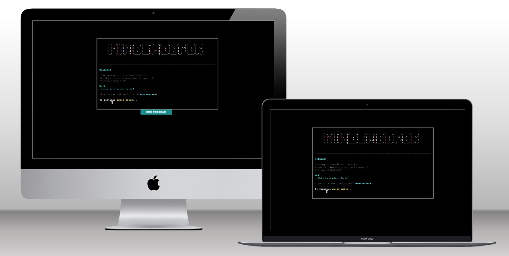

 

Deployed site can be accesed: [HERE](https://minesweeper-app.herokuapp.com).

 

## **Table of Contents**

- [Developer's Note](#developers-note)
- [How to Play](#how-to-play)
- [UX - User Experience Design](#ux---user-experience-design)
- [Logic](#logic)
- [Data Model](#data-model)
- [Features](#features)
- [Testing](#testing)
- [Bugs](#bugs)
- [Technologies Used](#technologies-used)
- [Deployment](#deployment)
- [Credits](#credits)

## **How to Play**

**Minesweeper** is a *single-player puzzle text-based game*. The objective is to *flag all mines* in the shortest amount of time. The fields of the game grid have three different states: **hidden, displayed and flagged**.  
A **hidden state** means the field did not receive any action yet. It's free to select for manipulation: *to be displayed or flagged*. 
The **displayed field** shows the number of mines surrounding that specific field. If the player selects and displays the field which indicates there are no mines nearby, *then all adjacent fields will be displayed*, until we get to the indicator that there is a mine nearby in either number or flag format. The displayed field cannot receive any action. 
The **flagged field** is an indicator of potential mine. When the user suspects there is a mine under the hidden field, they should flag it, otherwise, if the field is selected, and there is indeed a mine, it will be automatic loss. Flagged fields can be unflagged. This is important because there are only *so many flags available as there are mines on the grid*.  
If the user set all of their flags and did not win the game, it means some of the flags might not be positioned correctly. When all the correct fields are flagged the game is won. The game can also be won if the number of hidden fields is equal to mine count, there are no non-mine options left anyway. If you accidentally display a bomb, the game is instantly lost and the player will see the actual mine placements.

**Commands**
- Display a field: 
  - **row-value, col-value**
  - Correct examples:
    > *3,4*
    >
    > *3, 4*
    >
    > *3 , 4*
  - Incorrect examples:
    > *r3, 4*
    >
    > *3 4*
- Flag a mine: 
  - **flag-keyword, row-value, col-value**
  - Correct examples:
    > *flag, 3,4*
    >
    > *Flag , 3 , 4*
    >
    > *FLaG      , 3, 4*
  - Incorrect examples:
    > *f lag, 3,4*
    >
    > *flag3, 4*
    >
    > *mflag, 3, 4*
- Unflag a mine: 
  - Same as flag a mine.
  - **flag-keyword, row-value, col-value**

 

Back to [Table of Contents](#table-of-contents)

## **Developer's Note**

Minesweeper project is created as a **Portfolio Project** for Code Institute Full Stack Software Developer program.
The project showcases my skills in Python which I acquired as a Code Institute student.

**Note:** This website is created in educational purposes only, it's main purpose is to help me grasp different Python concepts and grow my skills as a developer.

**Note 2:** This project requirement was to use Code Institute provided template. All template files are included in "Initial commit". List of template files:
- Controllers folder
- Views folder
- index.js
- package.json
- Procfile
- .gitignore entires from the template:
  - core.Microsoft*
  - core.mongo*
  - core.python*
  - env.py
  - __ pycache__/
  - *.py[ cod]
  - node_modules/
  - .github/

 

Back to [Table of Contents](#table-of-contents)

## **UX - User Experience Design**

### **First time user**

> *I want to play the game quickly to see if it's worth my time.*
>
> *I want to be informed how to play the game, in a simple manner.*
>
> *I want the gameplay to be clean, without interruptions.*
>
> *I want to select the difficulty of the game.*
>
> *I want to see the game result, together with my score.*
>
> *I want to know what I did wrong if the game is lost.*
>
> *I want to be able to quit the game.*

### **Returning user**
Returning user stories are reserved and going to be implemented in next app version.

> *I want to be able to register.*
>
> *I want to be able to log in.*
>
> *I want my password to be stored securely.*
>
> *I want to see my top scores.*
>
> *I want to see how many wins, losses and total games I have.*
>
> *I want to see how much time I spent playing.*
>
> *I want to set the status in case I climb to the main leaderboard.*
>
> *I want to see the top scores overall.*
>
> *I want to customize the game mode.*

 

Back to [Table of Contents](#table-of-contents)

## **Logic**

The real-life application is moulded according to the created flowcharts. 
The flowcharts depict the flow of the app but also allow for an insight into the logic behind.
They do not depict the final product but are more of a pathway towards the end goal.

### **Flow of the app**
Displays the flow of the app as a whole, from start until the point the app is exited.
The flowchart serves as a general guideline on how the app is constructed, structured and what it will include.

 

Flowchart

 

### **Flow of the game**
Displays the flow of the game. The flow starts from the **"play game"** selection, goes over difficulty modes, the game, it's results and finally to the game menu itself. 
The flowchart will help with visualising how the gameplay should look, mainly from the player's point of view.

 

Flowchart

 

### **Additional flows**
Additional flows are flows of special commands and functions.

**Input validation** is a function that appears on numerous occasions. It's one of the most important functions as it ensures the values taken from the user are, in fact valid. Validation was taken out of the main flow, to ensure the flowchart's tidiness and readability. 

**Menu, Exit and Help commands** are global commands of the app. They can be accessed from almost every part of the app, even if the input was intended for a different purpose.
- **Menu** jumps instantly to the main menu, even if mid-game.
- **Exit** exits the app completely.
- **Help** displays the commands for that specific part of the program. 
  - *The reason behind the help is:* The commands are initially shown at the top of the screen, but as the user interacts with the page, commands are pushed further away. The user can forget how to properly enter commands and if they do, they can simply enter **"help"** and commands will be reprinted.

 

Flowchart

 

### **Logic of the game**
The logic of the game includes insight into how the game functions behind the scenes.

 

Flowchart

 

Back to [Table of Contents](#table-of-contents)

## **Data Model**

Though the database isn't included within the current version due to lack of time, the app is expected to grow and so the data model will remain within this document.

The [Google Sheet](https://www.google.com/sheets/about/) will be used as the Minesweeper app database. The database consists of three sheets, each represented by its unique ID.

### **User data**
User data stores the account and security information of the individual user.
 

### **User info data**
User info data stores game data relevant to the account. 
 

### **Leaderboard data**
Leaderboard data stores player scores with game mods for each individual user.
 

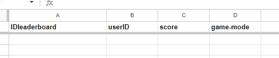

 

Back to [Table of Contents](#table-of-contents)

## **Features**

### **Welcome Screen**
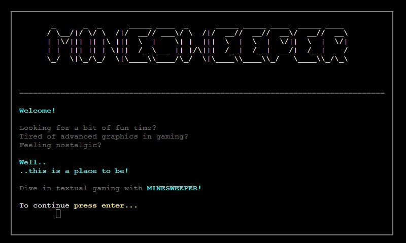
- Contains game title with text prompting the player to take action.
- The player can click enter and continue.

### **Intro Screen**
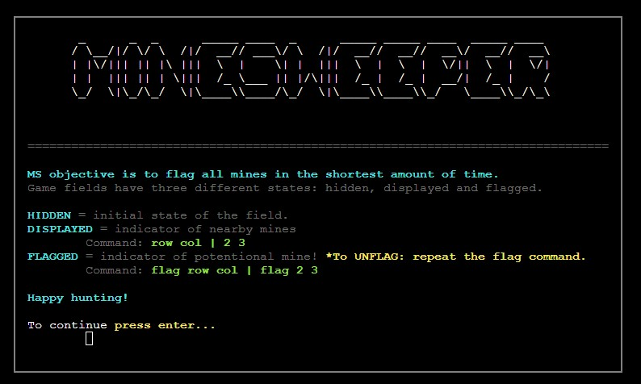
- Contains game title with intro text briefly explaining the game objective and commands.
- The player can click enter and continue.

### **Game Screen**
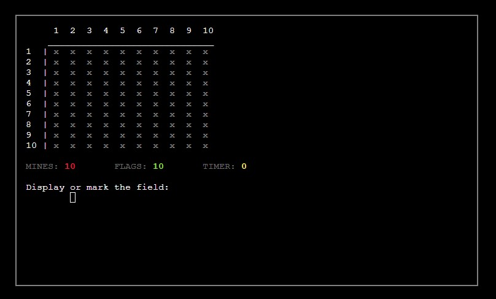
- Contains row and column indicators and the game board represented by "x" signs.
- The footer displays mines, flags and the timer.
  - **Mine** count represents how many mines are on the board. The number remains the same throughout the game.
  - **Flag** count represents how many flags are left. The flag count diminishes as the player sets them on the board. It can go into a negative value signalling that some flags are misplaced.
  - **Timer** counts how much time has passed from the beginning of one game. The same timer later represents the score, which can be negative, depending if the game is won or lost.
- The player is prompted to take an action, either to display or mark the field.

### **Display and Flag actions**
- **Display** action
  - Display action is used to display the hidden field.
  - Display command: **row, col**
    - The command takes in two numbers, the first one representing the row of the board and the second one column. Commands can be separated by either spaces or commas5
    - Commands are restricted by the type of input and range.
- **Flag** action
  - Flag action is used to indicate a mine without letting the mine go BOOM.
  - Flag command: **flag, row, col**
    - The command takes in three values:
      - **flag** command in itself, in a string format. The casing of the command is not important.
      - Two number values, same as with "display", representing the board's row and column.
    - The commands can be separated in the same way as with the "display" action, and are restricted by the same restrictions.
  - When flagging takes place, the **flag** counter decreases.
  - **Unflagging the flagged** field
    - Fields previously flagged can be unflagged by repeating the same flagging command.
    - When the field is unflagged, the **flag** counter increases.

### **INVALID Display and Flag actions**
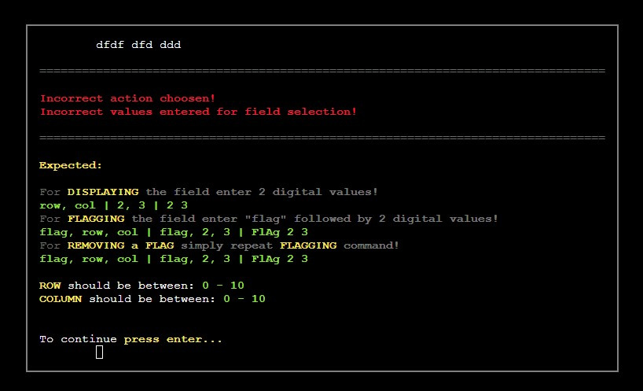
- Invalid actions can happen in several ways:
  - Player entered too few values/too many values,
  - Values entered are not of the correct format,
  - Values are out of range.
- Depending on the case, the correct error will be displayed, and if more than one is valid, they will display in a sequence.
- The error will always be followed by a helper script, pointing the player to what input is expected.
- The player is then prompted to press enter for continuation.

### **The Board**
- **Flagging command** can have two results:
  - The field is flagged/unflagged depending on its previous state.
  - 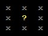
- **Displaying command** can have three variations:
  - **Display single field.**
    - Only displays the selected field.
    - This can happen because the field is either a numeric value or a **mine**.
      - If the field is indeed mine, the game is lost.
      - When a field is numerical, its value represents the number of mines adjacent to that specific field. The value can range from 0 to a maximum of 8.
        - 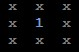
  - **Displaying multiple fields.**
    - When the field selected is **empty**, meaning there are no mines next to it, they will reveal its adjacent fields. The reveal will go on until numerical or flagged fields are hit.
    - 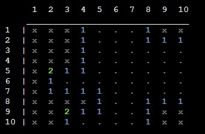
  - **Displaying flagged field.**
  -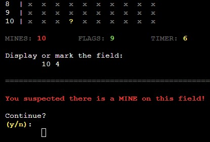
    - When attempting a direct display of the flagged field, the player will first encounter a warning text, followed by a confirmation prompt.
    - **Confirmation prompt.** can only register "y/n" single letter values.
      - When the player confirms, the field is displayed, and when confirmation is refused, the command cancels.
      - In the case of incorrect input, the player receives an error message, with repeated prompt.
- Attempting to display/flag an already "displayed" field results in an error. The player is then asked to go back to action selection.
  - 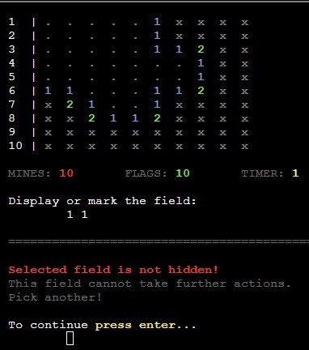

### **Victory and Defeat**
- **Defeat**
  - 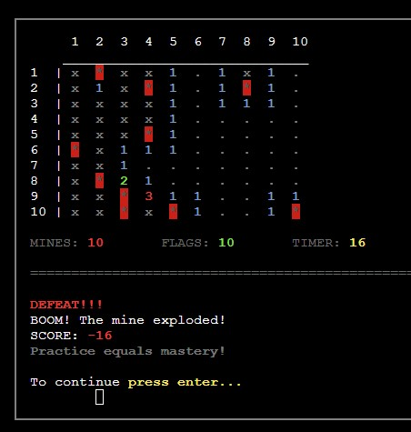
  - When the field selected is a mine, the game is lost.
  - Following defeat all the mines on the board are displayed, while the rest of the board is in the same state it was prior to defeat.
- **Victory**
  - 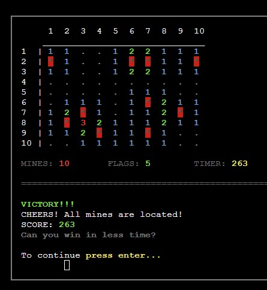
  - When all of the mines are flagged, the game is won. The game can also be won if the number of remaining hidden + flagged fields is equal to the mine count.
  - Following the victory, all board fields are displayed.
- The player is shown their result and prompted for continuation.
- **Scoring**
  - The minesweeper score is equal to the time passed from the starting point of the game.
  - The goal is to find all mines in the least time possible.
  - The score is considered higher by its proximity to zero, closer to zero, the higher the score.
  - Negative score is evaluated differently, it's there purely so the player is able to see how much time they spent playing. A negative score has a negative value. 
- **Play Again**
  - 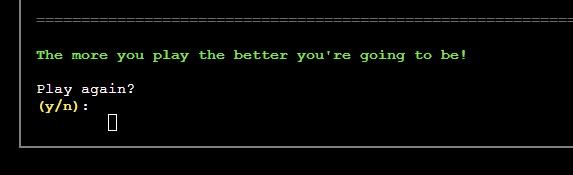
  - After the game is finished, the player is prompted to play again.
    - When the player agrees, a new game will start, and if the player refuses the app will finish.

Back to [Table of Contents](#table-of-contents)

## **Testing**
All files passed [PEP8](https://pep8ci.herokuapp.com) validation with no issues or warnings.

 

Run

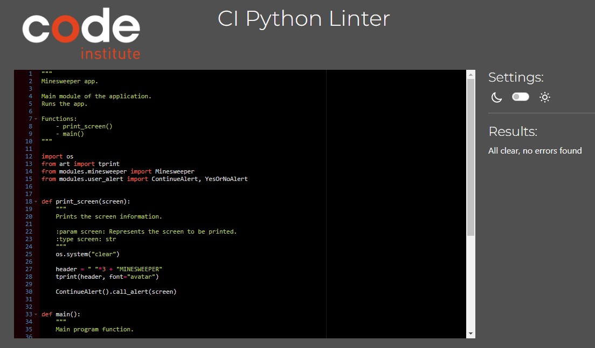

 

 

Minesweeper

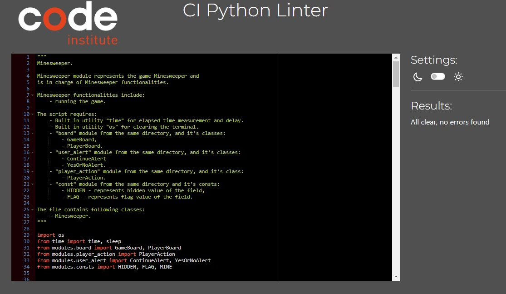

 

 

Board

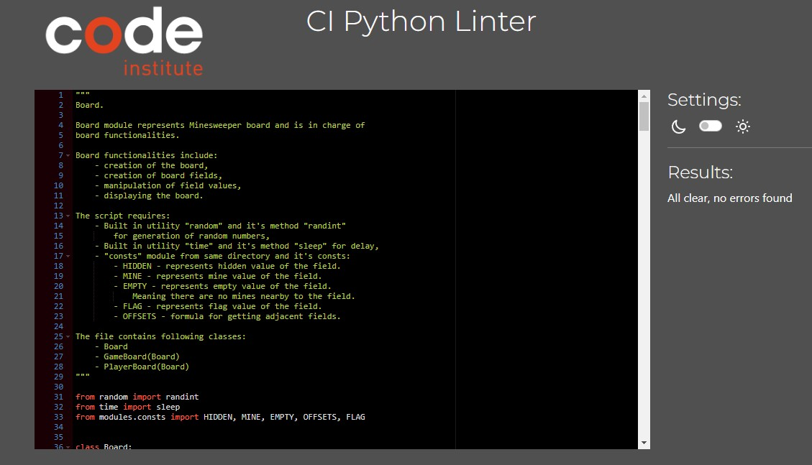

 

 

Player action

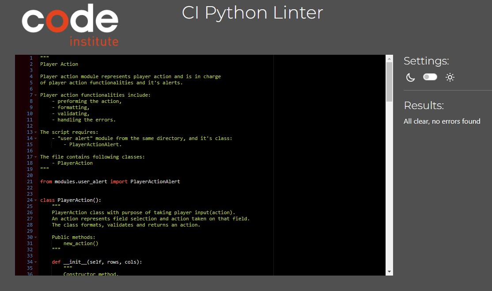

 

 

User alert

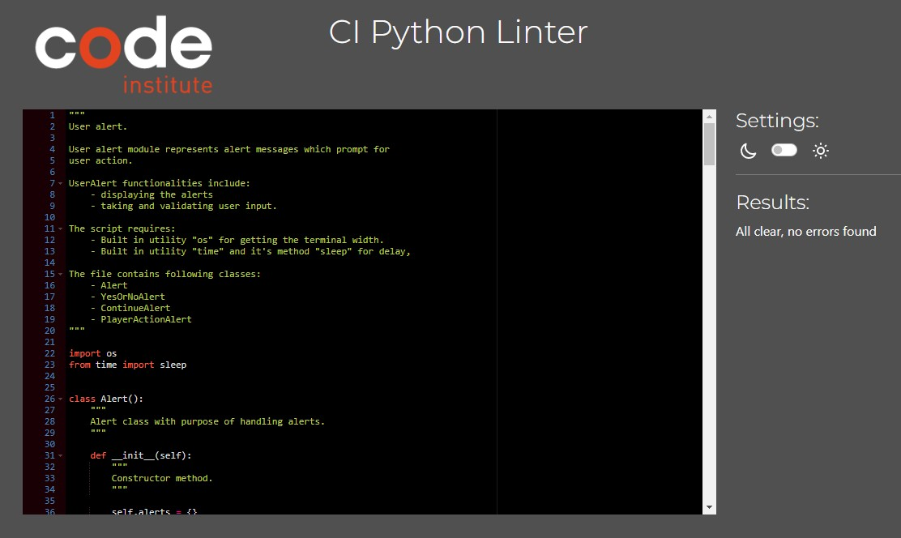

 

 

Consts

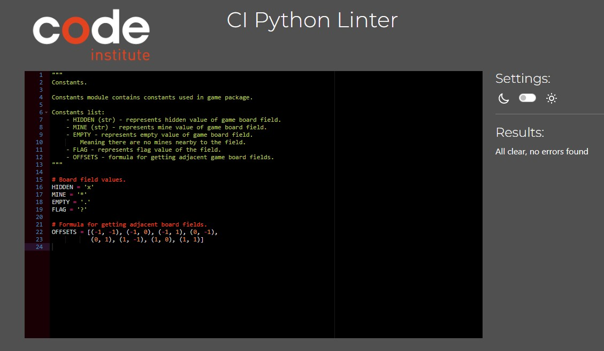

 

 

Datebase

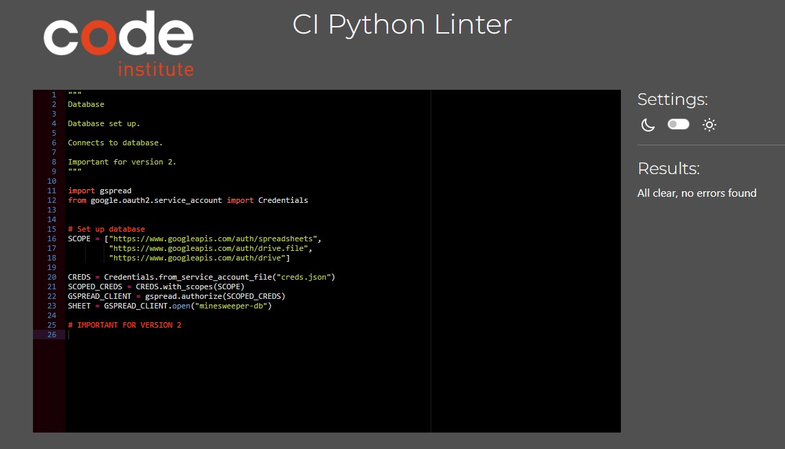

 

 

Init

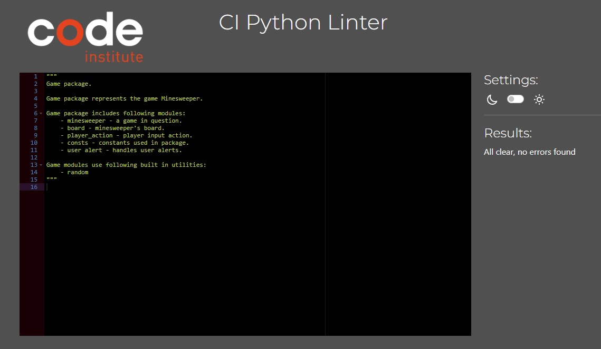

 

Back to [Table of Contents](#table-of-contents)

## **Bugs**

Back to [Table of Contents](#table-of-contents)

## **Technologies Used**

### **Languages**
- [Python](https://www.python.org)
- [HTML](https://html.spec.whatwg.org/multipage) & [CSS](https://www.w3.org/Style/CSS/Overview.en.html) - Website touch-ups.

### **Languages**Python Libraries/Modules
- [gspread](https://docs.gspread.org/en/latest) - API for Google Sheets.
- [OAuthLib](https://oauthlib.readthedocs.io/en/latest) - Google authentication.
- [os](https://docs.python.org/3/library/os.html?highlight=os#module-os) - Used to clear the screen and get terminal size.
- [time](https://docs.python.org/3/library/time.html) - Used to measure time and to provide execution delay.
- [art](https://pypi.org/project/art) - Used for ASCII art.
- [random](https://docs.python.org/3/library/random.html?highlight=random#module-random) - Used for generating random numbers.
- [colorama](https://pypi.org/project/colorama) - Used for colors.

### **Tools**
- [VScode](https://code.visualstudio.com) - IDE.
- [Git](https://git-scm.com) - Version control.
- [GitHub](https://github.com) - Code hosting.
- [Heroku](https://heroku.com) - Cloud platform.
- [Lucidchart](https://www.lucidchart.com) - Flowcharts.
- [Google Sheets](https://www.google.com/sheets/about) - Database.
- [CI template](https://github.com/Code-Institute-Org/python-essentials-template) - Code Institute 
template (altered).
- [Multi Mockup](https://techsini.com/multi-mockup/index.php) - Mockups.
- [PEP8](https://pep8ci.herokuapp.com) - Code validation.

 

Back to [Table of Contents](#table-of-contents)

## **Deployment**

### **Deployment to Heroku**

1. Create **requirements.txt**
    >- *pip3 freeze > requirements.txt*
2. Log into the Heroku account.
3. Click **"new"** and then **"Create new app"**.
4. Pick a unique name for the app, select the region and click **"Create app"**.
5. Once you have landed on a new page select the **"Settings"** tab and scroll down to **"Config Vars"** and click **"Reveal Config Vars"**.
    >- *The purpose of config vars, or environment variables is to store sensitive data that needs to be kept secret.*
    >- *Heroku needs to access the CREDS.json file, which stores API credentials. CREDS content is important and sensitive, so it needs to be hidden. We achieve hiding by listing CREDS.json in .gitignore.*
6. Enter **"CREDS"** in the **"KEY"** field. Copy CREDS.json contents and paste them into Heroku **"VALUE"** field. Click **"Add"**.
7. Enter **"PORT"** in the **"KEY"** field. Enter **"8000"** in the **"VALUE"** field.
8. Scroll down to the **"Buildpacks"** section, and click **"Add buildpack"**.
    >- *Select **"Python"** and click **"Save changes"**.*
    >- *Select **"nodejs"** and click **"Save changes"**.*
      >- ***"nodejs"** build pack is needed to handle mock terminal code.*
9. Scroll back up and select the **"Deploy"** tab.
10. Move a bit down and there will be **"Deployment method"**: pick **"GitHub"**.
11. Next to the **"Connect to GitHub"** section: enter the name of the GitHub repository and click **"Search"**.
12. After the correct repository is located: select **"Connect"**.
    >- *This will link up Heroku with the GitHub repository code.*
13. Scroll down to the **"Automatic and manual deploy"** section. Select the preffered option.
14. Scroll back up and select **"Open app"** to view the app.

 

Back to [Table of Contents](#table-of-contents)

## **Credits**

I would like to thank Code Institute and my mentor Narender Singh for pushing me in the right direction.

 

Back to [Table of Contents](#table-of-contents)