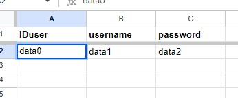

# Minesweeper

**Minesweeper** is a *puzzle-type text-based game* which runs directly in the terminal. The objective is to flag all mines in the shortest amount of time. The player can choose the desired difficulty from the predefined options or customize the game rules directly. The entire app can be accessed as a guest or as a registered user. If the user chooses to register, they will gain access to various gameplay information and be able to change their status.

## **Table of Contents**

- [Developer's Note](#developers-note)
- [How to Play](#how-to-play)
- [UX - User Experience Design](#ux---user-experience-design)
- [Logic](#logic)
- [Data Model](#data-model)
- [Features](#features)
- [Testing](#testing)
- [Bugs](#bugs)
- [Technologies Used](#technologies-used)
- [Deployment](#deployment)
- [Credits](#credits)

## **How to Play**

**Minesweeper** is a *single-player puzzle text-based game*. The objective is to *flag all mines* in the shortest amount of time. The fields of the game grid have three different states: **hidden, displayed and flagged**.  
A **hidden state** means the field did not receive any action yet. It's free to select for manipulation: *to be displayed or flagged*. 
The **displayed field** shows the number of mines surrounding that specific field. If the player selects and displays the field which indicates there are no mines nearby, *then all adjacent fields will be displayed*, until we get to the indicator that there is a mine nearby in either number or flag format. The displayed field cannot receive any action. 
The **flagged field** is an indicator of potential mine. When the user suspects there is a mine under the hidden field, they should flag it, otherwise, if the field is selected, and there is indeed a mine, it will be automatic loss. Flagged fields can be unflagged. This is important because there are only *so many flags available as there are mines on the grid*.  
If the user set all of their flags and did not win the game, it means some of the flags might not be positioned correctly. When all the correct fields are flagged the game is won. The game can also be won if the number of hidden fields is equal to mine count, there are no non-mine options left anyway. If you accidentally display a bomb, the game is instantly lost and the player will see the actual mine placements.

**Commands**
- Display a field: 
  - **row-value, col-value**
  - Correct examples:
    > *3,4*
    >
    > *3, 4*
    >
    > *3 , 4*
  - Incorrect examples:
    > *r3, 4*
    >
    > *3 4*
- Flag a mine: 
  - **flag-keyword, row-value, col-value**
  - Correct examples:
    > *flag, 3,4*
    >
    > *Flag , 3 , 4*
    >
    > *FLaG      , 3, 4*
  - Incorrect examples:
    > *f lag, 3,4*
    >
    > *flag3, 4*
    >
    > *mflag, 3, 4*
- Unflag a mine: 
  - Same as flag a mine.
  - **flag-keyword, row-value, col-value**

### **Game Modes**

The player can choose between easy, normal, hard and fun modes. 
All modes except the fun one come with a predefined number of grid rows, columns and mines.

#### **Easy mode**
  > *Num of rows:*
  >
  > *Num of cols:*
  >
  > *Num of mines:*

#### **Normal mode**
  > *Num of rows:*
  >
  > *Num of cols:*
  >
  > *Num of mines:*

#### **Hard mode**
  > *Num of rows:*
  >
  > *Num of cols:*
  >
  > *Num of mines:*

#### **Fun mode**
- Fun mode allows players to customize the game. The player can select a number of rows, columns and mines they wish to play with, but is at the same time restricted with minimum and maximum values they can select.
  > *Num of rows:*
  >
  > *Num of cols:*
  >
  > *Num of mines:*

Back to [Table of Contents](#table-of-contents)

## **Developer's Note**
Minesweeper project is created as a **Portfolio Project** for Code Institute Full Stack Software Developer program.
The project showcases my skills in Python which I acquired as a Code Institute student.

**Note:** This website is created in educational purposes only, it's main purpose is to help me grasp different Python concepts and grow my skills as a developer.

**Note 2:** This project requirement was to use Code Institute provided template. All template files are included in "Initial commit". List of template files:
- Controllers folder
- Views folder
- index.js
- package.json
- Procfile
- .gitignore entires from the template:
  - core.Microsoft*
  - core.mongo*
  - core.python*
  - env.py
  - __ pycache__/
  - *.py[ cod]
  - node_modules/
  - .github/

Back to [Table of Contents](#table-of-contents)

## **UX - User Experience Design**

### **First time user**

> *I want to play the game quickly to see if it's worth my time.*
>
> *I want to be informed how to play the game, in a simple manner.*
>
> *I want the gameplay to be clean, without interruptions.*
>
> *I want to select the difficulty of the game.*
>
> *I want to see the game result, together with my score.*
>
> *I want to know what I did wrong if the game is lost.*
>
> *I want to be able to quit the game.*

### **Returning user**

> *I want to be able to register.*
>
> *I want to be able to log in.*
>
> *I want my password to be stored securely.*
>
> *I want to see my top scores.*
>
> *I want to see how many wins, losses and total games I have.*
>
> *I want to see how much time I spent playing.*
>
> *I want to set the status in case I climb to the main leaderboard.*
>
> *I want to see the top scores overall.*
>
> *I want to customize the game mode.*

Back to [Table of Contents](#table-of-contents)

## **Logic**

The real-life application is moulded according to the created flowcharts. 
The flowcharts depict the flow of the app but also allow for an insight into the logic behind.

### **Flow of the app**

Displays the flow of the app as a whole, from start until the point the app is exited.
The flowchart serves as a general guideline on how the app is constructed, structured and what it will include.

 

Flowchart

 

### **Flow of the game**

Displays the flow of the game. The flow starts from the **"play game"** selection, goes over difficulty modes, the game, it's results and finally to the game menu itself. 
The flowchart will help with visualising how the gameplay should look, mainly from the player's point of view.

 

Flowchart

 

### **Additional flows**

Additional flows are flows of special commands and functions.

**Input validation** is a function that appears on numerous occasions. It's one of the most important functions as it ensures the values taken from the user are, in fact valid. Validation was taken out of the main flow, to ensure the flowchart's tidiness and readability. 

**Menu, Exit and Help commands** are global commands of the app. They can be accessed from almost every part of the app, even if the input was intended for a different purpose.
- **Menu** jumps instantly to the main menu, even if mid-game.
- **Exit** exits the app completely.
- **Help** displays the commands for that specific part of the program. 
  - *The reason behind the help is:* The commands are initially shown at the top of the screen, but as the user interacts with the page, commands are pushed further away. The user can forget how to properly enter commands and if they do, they can simply enter **"help"** and commands will be reprinted.

 

Flowchart

 

### **Logic of the game**

The logic of the game includes insight into how the game functions behind the scenes.

 

Flowchart

 

Back to [Table of Contents](#table-of-contents)

## **Data Model**

The [Google Sheet](https://www.google.com/sheets/about/) is used as the Minesweeper app database. The database consists of four sheets, each represented by its unique ID.

### **User data**

User data stores the account and security information of the individual user.
 

### **User info data**

User info data stores game data relevant to the account. 
 

### **Player leaderboard data**

Player leaderboard data stores a list of the top 5 high scores in each game mode for every user.
 

### **Game leaderboard data**

Game leaderboard data stores the top 10 high scores in each game mode. Leaderboard information is shared between different users.
 

Back to [Table of Contents](#table-of-contents)

## **Features**

Back to [Table of Contents](#table-of-contents)

## **Testing**

Back to [Table of Contents](#table-of-contents)

## **Bugs**

Back to [Table of Contents](#table-of-contents)

## **Technologies Used**

### **Tools**
- [VScode](https://code.visualstudio.com) - IDE.
- [Git](https://git-scm.com/) - Version control.
- [GitHub](https://github.com) - Code hosting.
- [Lucidchart](https://www.lucidchart.com/) - Flowcharts.
- [Google Sheets](https://www.google.com/sheets/about/) - Database.

## **Deployment**

### **Deployment to Heroku**
1. Create **requirements.txt**
    - pip3 freeze > requirements.txt
2. Log into the Heroku account.
3. Click **"new"** and then **"Create new app"**.
4. Pick a unique name for the app, select the region and click **"Create app"**.
5. Once you have landed on a new page select the **"Settings"** tab and scroll down to **"Config Vars"** and click **"Reveal Config Vars"**.
    - The purpose of config vars, or environment variables is to store sensitive data that needs to be kept secret.
    - Heroku needs to access the CREDS.json file, which stores API credentials. CREDS content is important and sensitive, so it needs to be hidden. We achieve hiding by listing CREDS.json in .gitignore.
6. Enter **"CREDS"** in the **"KEY"** field. Copy CREDS.json contents and paste them into Heroku **"VALUE"** field. Click **"Add"**.
7. Enter **"PORT"** in the **"KEY"** field. Enter **"8000"** in the **"VALUE"** field.
8. Scroll down to the **"Buildpacks"** section, and click **"Add buildpack"**.
    - Select **"Python"** and click **"Save changes"**.
    - Select **"nodejs"** and click **"Save changes"**.
      - **"nodejs"** build pack is needed to handle mock terminal code.
9. Scroll back up and select the **"Deploy"** tab.
10. Move a bit down and there will be **"Deployment method"**: pick **"GitHub"**.
11. Next to the **"Connect to GitHub"** section: enter the name of the GitHub repository and click **"Search"**.
12. After the correct repository is located: select **"Connect"**.
    - This will link up Heroku with the GitHub repository code.
13. Scroll down to the **"Automatic and manual deploy"** section. Select the preffered option.
14. Scroll back up and select **"Open app"** to view the app.

Back to [Table of Contents](#table-of-contents)

## **Credits**

Back to [Table of Contents](#table-of-contents)